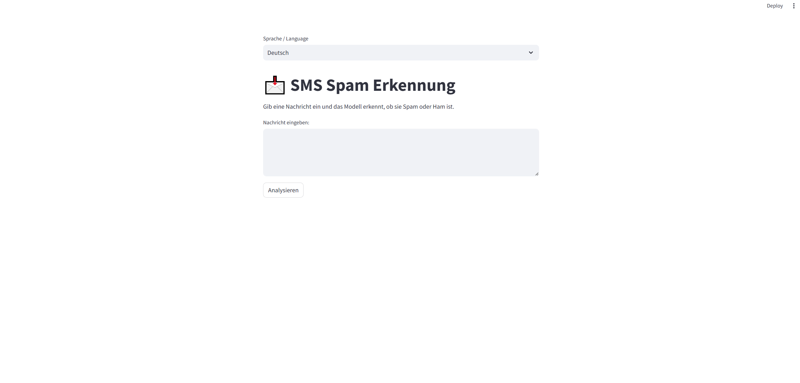
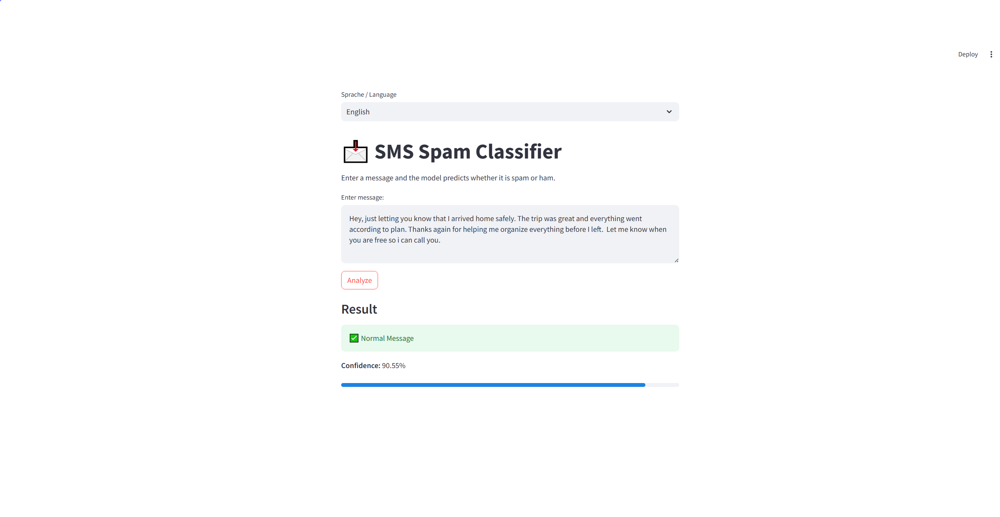
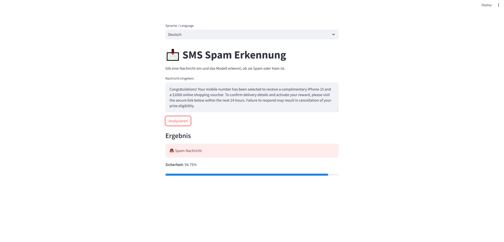
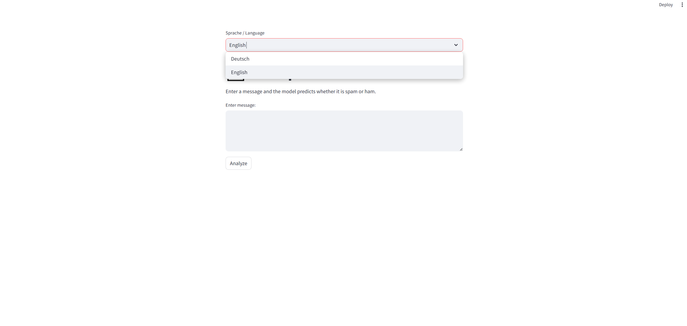

# SMS Spam Classifier

Ein Machine-Learning-Projekt zur Erkennung von Spam-SMS mit Python, scikit-learn und Streamlit.

---

## Projektbeschreibung

Dieses Projekt klassifiziert SMS-Nachrichten als:

- Spam
- Ham (normale Nachricht)

Das Modell verwendet:
- TF-IDF Vectorization
- Logistic Regression

Zusätzlich enthält das Projekt:
- Textbereinigung
- Modelltraining
- Modell-Evaluation
- gespeicherte ML-Modelle
- eine zweisprachige Streamlit-Web-App (Deutsch / English)

---

## Technologien

- Python
- pandas
- scikit-learn
- Streamlit
- joblib

---

## Projektstruktur

```text
sms_spam_classifier/
│
├── app.py
├── README.md
├── requirements.txt
│
├── data/
│   ├── spam.csv
│   └── SMSSpamCollection
│
├── models/
│   ├── spam_model.pkl
│   ├── vectorizer.pkl
│   └── encoder.pkl
│
├── screenshots/
│   ├── home.png
│   ├── ham_result.png
│   ├── spam_result.png
│   └── language_switch.png
│
└── src/
    ├── train.py
    ├── predict.py
    ├── evaluate_model.py
    └── text_cleaning.py
```

---

## Funktionen

- Training eines Spam-Klassifikators
- Vorhersage einzelner Nachrichten
- Bewertung des Modells mit:
  - Accuracy
  - Precision
  - Recall
  - F1-Score
  - Confusion Matrix
- Speicherung und Laden trainierter Modelle
- Zweisprachige Benutzeroberfläche
- Interaktive Web-App mit Streamlit

---

## Installation

Repository klonen:

```bash
git clone <repository-link>
```

Benötigte Bibliotheken installieren:

```bash
pip install -r requirements.txt
```

---

## Anwendung starten

### Modell trainieren

```bash
python src/train.py
```

### Modell evaluieren

```bash
python src/evaluate_model.py
```

### Web-App starten

```bash
streamlit run app.py
```

---

## Beispiel

### Ham-Nachricht

Input:

```text
Hey, just letting you know that I arrived home safely. The trip was great and everything went according to plan. Thanks again for helping me organize everything before I left.  Let me know when you are free so i can call you.
```

Ergebnis:

```text
Normal Message — 90,55%
```

---

### Spam-Nachricht

Input:

```text
Congratulations! Your mobile number has been selected to receive a complimentary iPhone 15 and a $1000 online shopping voucher. To confirm delivery details and activate your reward, please visit the secure link below within the next 24 hours. Failure to respond may result in cancellation of your prize eligibility.
```

Ergebnis:

```text
Spam Message — 94,75%
```

---

## Evaluation

Das Modell erreicht ungefähr:

- Accuracy: 99%
- Spam Precision: 96%
- Spam Recall: 97%

---

## Screenshots

### Startseite



---

### Ham-Erkennung



---

### Spam-Erkennung



---

### Sprachwechsel



---
## Limitations

The model was trained on an English SMS dataset and therefore provides the most reliable predictions for English messages. Predictions for other languages may be less accurate.

## Was ich gelernt habe

- Textdaten verarbeiten und bereinigen
- Machine-Learning-Modelle trainieren
- TF-IDF-Vektorisierung
- Modell-Evaluation
- Modelle speichern und laden
- Aufbau einer kleinen ML-Web-App
- Strukturierung eines Python-Projekts
- Mehrsprachige Benutzeroberflächen#   s m s - s p a m - c l a s s i f i e r 
 
 